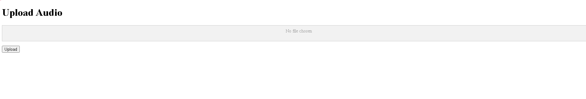

# Audio Classification App

## Overview

This is a prototype Django application that allows users to upload audio files and classify them using machine learning techniques. The app uses Principal Component Analysis (PCA) for feature reduction and K-Nearest Neighbors (KNN) for classification. The application is designed to be extendable, allowing for the addition of more data and classes in the future.

## Features

- **Upload Audio Files**: Users can upload audio files through a web interface.
- **Feature Extraction**: Extracts Mel-Frequency Cepstral Coefficients (MFCC) from the audio files.
- **Dimensionality Reduction**: Uses PCA to reduce the dimensionality of the extracted features.
- **Classification**: Classifies the audio files using a pre-trained KNN model.
- **Results Display**: Shows the predicted class of the uploaded audio file.

## Installation

1. **Clone the Repository**:

```bash
git clone https://github.com/yourusername/audio_classification.git
cd audio_classification
```

2. **Create a Virtual Environment**:

```bash
python -m venv venv
source venv/bin/activate  # On Windows use `venv\Scripts\activate`
```

3. **Install Dependencies**:

```bash
pip install -r requirements.txt
```  

4. **Run Migrations**:

```bash
python manage.py migrate
```

5. **Start the Development Server**:

```bash
python manage.py runserver
```


6. **Access the Application**:
    Open your web browser and go to `http://127.0.0.1:8000/`.

## Usage

1. **Upload an Audio File**:
    - Navigate to the upload page.
    - Select an audio file and click the "Upload" button.

2. **View Classification Results**:
    - After uploading, you will be redirected to a results page showing the predicted class of the audio file.

## Concepts

### Feature Extraction

The application uses the `librosa` library to extract MFCC features from the audio files. MFCCs are commonly used in audio processing to represent the short-term power spectrum of a sound.

### Dimensionality Reduction

PCA is used to reduce the dimensionality of the extracted features. This helps in reducing noise and simplifying the data for classification.

### Classification

A pre-trained KNN model is used to classify the audio files. KNN is a simple, yet effective, classification algorithm that assigns a class based on the majority class of the nearest neighbors.

## Extending the Application

This application is a prototype and can be extended in several ways:

- **Add More Data**: Collect and label more audio files to improve the accuracy of the model.
- **Extract Additional Features**: Use other audio features like chroma, spectral contrast, etc.
- **Use Advanced Models**: Experiment with more complex models like Convolutional Neural Networks (CNN) or Recurrent Neural Networks (RNN).

## Screenshots

### Upload Page


### Results Page


## License

This project is licensed under the MIT License. See the [LICENSE](LICENSE) file for details.

## Acknowledgements

- [librosa](https://librosa.org/) for audio processing.
- [scikit-learn](https://scikit-learn.org/) for machine learning algorithms.
- [Django](https://www.djangoproject.com/) for the web framework.
