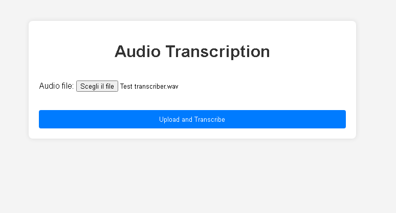
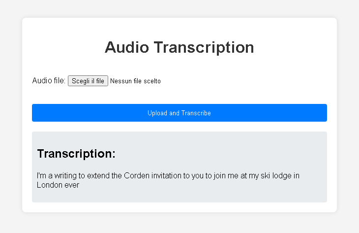

# Audio Transcription Project

## Project Description

This project is a Django-based web application that allows users to upload audio files and get the transcription of the audio content. It uses the `speech_recognition` library to transcribe the audio.

## Installation

1. Clone the repository:

git clone  cd audio_transcription

2. Create a virtual environment and activate it:

python -m venv venv source venv/bin/activate

3. Install the dependencies:
   
pip install -r requirements.txt

4. Run the database migrations:

python manage.py migrate

6. Visit `http://127.0.0.1:8000/` in your browser.

## Usage

1. Upload an audio file using the form on the main page.
2. Click "Upload and Transcribe".
3. View the transcription of the audio content on the page.

## Dependencies

- Django
- speech_recognition

## Contributions

Contributions are welcome! Feel free to open issues and pull requests.

## ScreenShot

## License

This project is licensed under the MIT License. See the `LICENSE` file for more details.

   
      
   
